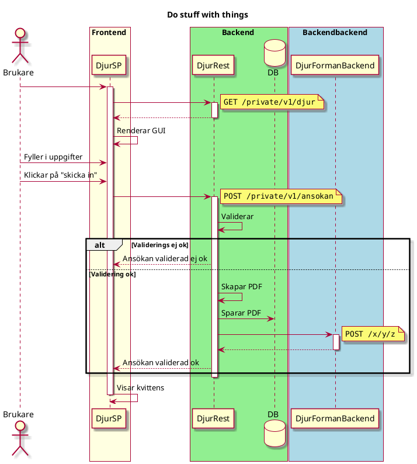

# JAR Template

See [gradle-conventions](https://github.com/Forsakringskassan/gradle-conventions).

Maven artefact: <https://github.com/orgs/Forsakringskassan/packages?repo_name=template-jar>

## Sequence Diagram

